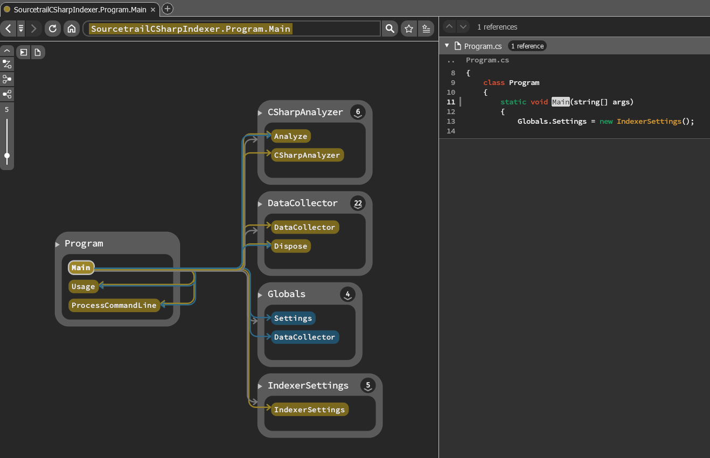

This project attempts to create [Sourcetrail](https://www.sourcetrail.com/)-Databases from C# source code.  
It is an offspring to my first project in the area of code-analysis, [SourcetrailDotnetIndexer](https://github.com/packdat/SourcetrailDotnetIndexer).  

It uses the [Roslyn](https://github.com/dotnet/roslyn) compiler to parse the source and gather symbol-information.  
It uses [SourcetrailDB](https://github.com/CoatiSoftware/SourcetrailDB) for writing the Sourcetrail-database.  
For convenience, the native DLL for *SourcetrailDB* is already included, so you don't have to build it yourself.  
Note, the native DLL is a x64 DLL so in your project settings, you have to specify `x64` as the target platform as well.

----

Note, this project is in a very early and experimental state.  
It probably contains bugs, so please be aware.

Contributors welcome !
---
As i'm only able to work on this project in my spare time, anyone who is able to contribute is welcome to do so !  
If you have already worked with Roslyn, please check out the code and report any bugs you find or tell me how this tool can be made more efficient.  

Building
--------
Open the `.sln` in VisualStudio and build.  
Make sure, you set the target-platform to `x64` ! (because of the native SourcetrailDB.dll)

Usage
-----
The following command-line arguments are supported:

* -i `Input-File/Path`  
  Specifies the full path of a file or a folder to index  
  If the argument refers to a folder, all *.cs-files in this folder and all sub-folders will be included  
  may be specified multiple times  
* -o `OutputFilename`  
  Full path and filename of the generated Sourcetrail-database  
* -r `AssemblyPathOrFileName`  
  Specifies the path to a reference-assembly (used for type-resolution)  
  If the argument refers to a folder, all assemblies in this folder will be referenced  
  may be specified multiple times  
* -fp `Framework-Path`  
  Specifies the path to the .net-framework, your application is based on  
  By default, the indexer attempts to use the .net5 assemblies  
* -ox (OmitExternals)  
  Specifies, that types from referenced assemblies should be omitted from the generated database  

**Examples**:  
* Creating a database for the indexer itself  
  Assuming, the sources are stored in `C:\code\SourcetrailCSharpIndexer\SourcetrailCSharpIndexer`  
  The indexer is run from the output-folder (e.g. `\bin\Debug\net5.0`)  
  > SourcetrailCSharpIndexer 
  > -i C:\code\SourcetrailCSharpIndexer\SourcetrailCSharpIndexer 
  > -o CSharpIndexer.srctrldb -ox  
  
  This generates the files `CSharpIndexer.srctrldb` and `CSharpIndexer.srctrlprj` in the current directory.  
  The file `CSharpIndexer.srctrlprj` is the one you open in Sourcetrail (via the **Open Project** command)  
  
  If you open the database in Sourcetrail, you will notice that there are several errors reported in the database.  
  This is because we did not reference the assemblies, that are required to actually compile and build the project.  
  To add these assemblies, we build the project once in VisualStudio and then reference the assemblies from the output-folder.  
* Extending the first example with referenced assemblies  
  > SourcetrailCSharpIndexer 
  > -i C:\code\SourcetrailCSharpIndexer\SourcetrailCSharpIndexer
  > -o CSharpIndexer.srctrldb -ox
  > -r C:\code\SourcetrailCSharpIndexer\SourcetrailCSharpIndexer\bin\Debug\net5.0  
  
  If you re-open the database in Sourcetrail, the errors should be gone.  

Screenshots
---

After executing the second example, open the database in Sourcetrail, select the class `Program` and inside that class the method `Main`  
You should see something like this:  
  
